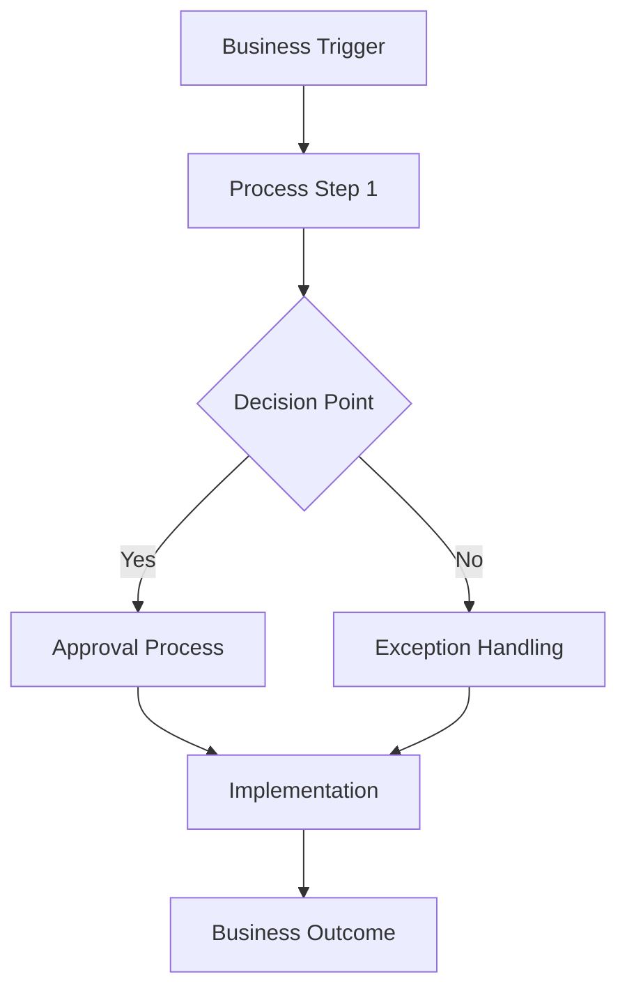

# Business Detailed Design Skill

## Overview

Business-focused design approach emphasizing stakeholder value, business process integration, and organizational impact.

## Business Design Sections

### Core Business Design Elements

**Business Architecture:**
- Stakeholder interaction model
- Business process flows
- Value stream mapping
- Organizational impact analysis

**Business Logic Design:**
- Business rules and policies
- Decision frameworks
- Approval workflows
- Exception handling processes

**Stakeholder Experience Design:**
- User journey mapping
- Touchpoint analysis
- Service design blueprints
- Change management considerations

**Business Integration Design:**
- Process integration points
- Data flow between business units
- Reporting and analytics requirements
- Governance and compliance frameworks

### Business Design Options Framework

When evaluating design options, consider:

**Business Impact Assessment:**
- Stakeholder adoption complexity
- Process change requirements
- Training and support needs
- Timeline to business value

**Risk-Benefit Analysis:**
- Implementation risks
- Business continuity impact
- Scalability considerations
- Future flexibility

**Resource Requirements:**
- Human resource needs
- Budget implications
- Technology dependencies
- Ongoing operational costs

## Business Design Templates

### Stakeholder Impact Matrix
| Stakeholder Group | Current State | Future State | Impact Level | Change Required |
|-------------------|---------------|--------------|--------------|------------------|
| Primary Users | | | | |
| Decision Makers | | | | |
| Support Teams | | | | |

### Business Process Flow

### Value Realization Plan
- **Immediate Value** (0-3 months)
- **Short-term Value** (3-12 months)
- **Long-term Value** (12+ months)

## Business Design Considerations

**Change Management:**
- Communication strategy
- Training requirements
- Support structures
- Resistance mitigation

**Governance:**
- Decision rights
- Escalation procedures
- Quality assurance
- Compliance monitoring

**Performance Measurement:**
- Business KPIs
- Success metrics
- Monitoring approach
- Reporting requirements