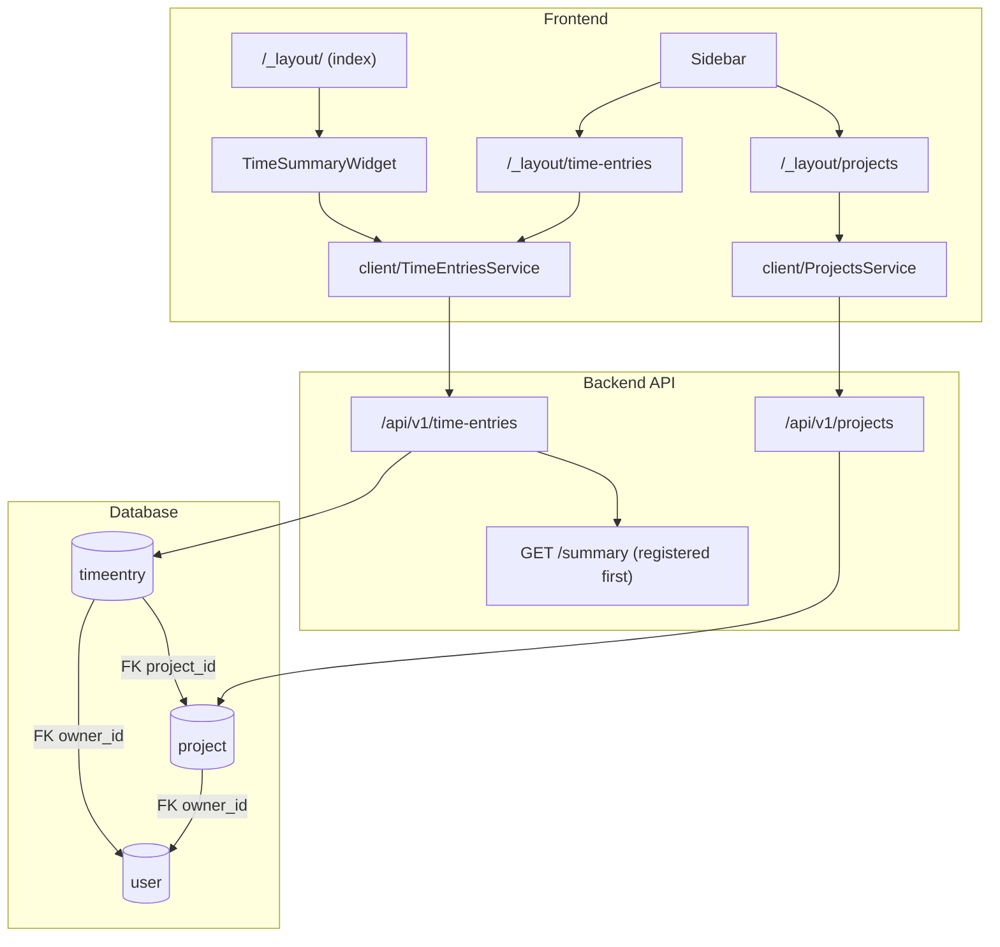
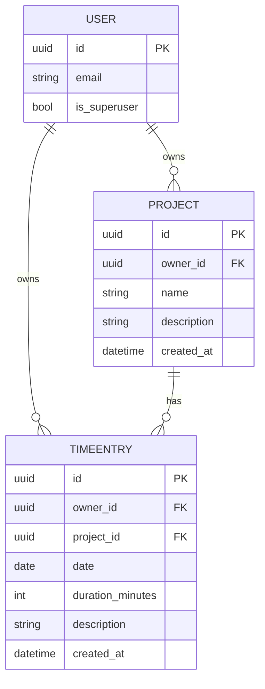

# Design Document: Time Tracking

## Overview

This feature adds time tracking to the full-stack-fastapi-template application. Users create Projects (named groupings) and log TimeEntries (duration + date + optional description) against them. A summary endpoint aggregates total minutes and per-project breakdowns. The frontend adds two new pages (Projects, Time Entries), a dashboard widget, and two sidebar navigation links.

The implementation follows the existing Items pattern end-to-end: SQLModel table definitions in `models.py`, FastAPI CRUD routes, pytest integration tests, and TanStack Router/Query frontend pages with the same component structure (Add/Edit/Delete dialogs, ActionsMenu, columns, Pending skeleton).

---

## Architecture



**Key architectural decisions:**

- `GET /api/v1/time-entries/summary` is registered **before** `GET /api/v1/time-entries/{id}` to prevent FastAPI treating the literal string `"summary"` as a UUID path parameter.
- The summary endpoint uses a single aggregation query (SQLAlchemy `func.sum` + `group_by`) rather than loading all rows into Python, keeping it efficient at scale.
- Frontend client code (`ProjectsService`, `TimeEntriesService`) is auto-generated via `openapi-ts` after the backend routes are registered — no manual client code is written.

---

## Components and Interfaces

### Backend

#### `backend/app/models.py` (additions)

New table classes and schemas appended following the existing Item pattern.

#### `backend/app/api/routes/projects.py`

```
APIRouter prefix="/projects", tags=["projects"]

GET  /           → ProjectsPublic   (paginated, owner-scoped or all for superuser)
POST /           → ProjectPublic    (create, owner_id = current_user.id)
GET  /{id}       → ProjectPublic    (404 before 403)
PUT  /{id}       → ProjectPublic    (partial update, 404 before 403)
DELETE /{id}     → Message          (404 before 403)
```

#### `backend/app/api/routes/time_entries.py`

```
APIRouter prefix="/time-entries", tags=["time-entries"]

GET  /summary    → TimeSummary      (MUST be registered before /{id})
GET  /           → TimeEntriesPublic
POST /           → TimeEntryPublic  (validates project_id exists + ownership)
GET  /{id}       → TimeEntryPublic  (404 before 403)
PUT  /{id}       → TimeEntryPublic  (partial update, 404 before 403)
DELETE /{id}     → Message          (404 before 403)
```

#### `backend/app/api/main.py` (modification)

```python
from app.api.routes import items, login, private, projects, time_entries, users, utils
api_router.include_router(projects.router)
api_router.include_router(time_entries.router)
```

### Frontend

#### New route files

| File | Route | Purpose |
|---|---|---|
| `routes/_layout/projects.tsx` | `/_layout/projects` | Projects CRUD page |
| `routes/_layout/time-entries.tsx` | `/_layout/time-entries` | Time Entries CRUD page |

#### New component directories

**`components/Projects/`**

| Component | Purpose |
|---|---|
| `AddProject.tsx` | Dialog — name (required) + description (optional), calls `ProjectsService.createProject` |
| `EditProject.tsx` | Dialog — pre-populated, calls `ProjectsService.updateProject` |
| `DeleteProject.tsx` | Confirmation dialog, calls `ProjectsService.deleteProject` |
| `ProjectActionsMenu.tsx` | Dropdown with Edit + Delete items |
| `columns.tsx` | `ColumnDef<ProjectPublic>[]` — name, description, created date, actions |
| `PendingProjects.tsx` | Skeleton table (5 rows × 4 columns) |

**`components/TimeEntries/`**

| Component | Purpose |
|---|---|
| `AddTimeEntry.tsx` | Dialog — project select, date, duration_minutes (min 1, client-validated), description |
| `EditTimeEntry.tsx` | Dialog — pre-populated, calls `TimeEntriesService.updateTimeEntry` |
| `DeleteTimeEntry.tsx` | Confirmation dialog, calls `TimeEntriesService.deleteTimeEntry` |
| `TimeEntryActionsMenu.tsx` | Dropdown with Edit + Delete items |
| `columns.tsx` | `ColumnDef<TimeEntryPublic>[]` — project name, date, duration (formatted "Xh Ym"), description, actions |
| `PendingTimeEntries.tsx` | Skeleton table (5 rows × 5 columns) |

**`components/Dashboard/TimeSummaryWidget.tsx`**

Uses `useQuery` (not suspense) for `TimeEntriesService.getTimeSummary`. Renders:
- Loading: skeleton matching widget structure
- Empty (`total_minutes === 0`): "No time logged yet" message + empty breakdown list
- Populated: formatted total ("Xh Ym") + per-project breakdown list

#### Modified files

**`components/Sidebar/AppSidebar.tsx`** — add to `baseItems`:
```typescript
{ icon: FolderOpen, title: "Projects", path: "/projects" },
{ icon: Clock, title: "Time Entries", path: "/time-entries" },
```

**`routes/_layout/index.tsx`** — import and render `<TimeSummaryWidget />` below the greeting.

---

## Data Models

### `Project` (table)

```python
class ProjectBase(SQLModel):
    name: str = Field(min_length=1, max_length=255)
    description: str | None = Field(default=None, max_length=255)

class ProjectCreate(ProjectBase):
    pass

class ProjectUpdate(ProjectBase):
    name: str | None = Field(default=None, min_length=1, max_length=255)

class Project(ProjectBase, table=True):
    id: uuid.UUID = Field(default_factory=uuid.uuid4, primary_key=True)
    created_at: datetime | None = Field(
        default_factory=get_datetime_utc,
        sa_type=DateTime(timezone=True),
    )
    owner_id: uuid.UUID = Field(foreign_key="user.id", nullable=False, ondelete="CASCADE")
    owner: User | None = Relationship(back_populates="projects")
    time_entries: list["TimeEntry"] = Relationship(back_populates="project", cascade_delete=True)

class ProjectPublic(ProjectBase):
    id: uuid.UUID
    owner_id: uuid.UUID
    created_at: datetime | None = None

class ProjectsPublic(SQLModel):
    data: list[ProjectPublic]
    count: int
```

`User` model gains: `projects: list["Project"] = Relationship(back_populates="owner", cascade_delete=True)`

### `TimeEntry` (table)

```python
class TimeEntryBase(SQLModel):
    project_id: uuid.UUID
    date: date                                          # calendar date (datetime.date)
    duration_minutes: int = Field(ge=1)
    description: str | None = Field(default=None, max_length=255)

class TimeEntryCreate(TimeEntryBase):
    pass

class TimeEntryUpdate(TimeEntryBase):
    project_id: uuid.UUID | None = None
    date: date | None = None
    duration_minutes: int | None = Field(default=None, ge=1)

class TimeEntry(TimeEntryBase, table=True):
    id: uuid.UUID = Field(default_factory=uuid.uuid4, primary_key=True)
    created_at: datetime | None = Field(
        default_factory=get_datetime_utc,
        sa_type=DateTime(timezone=True),
    )
    owner_id: uuid.UUID = Field(foreign_key="user.id", nullable=False, ondelete="CASCADE")
    project_id: uuid.UUID = Field(foreign_key="project.id", nullable=False, ondelete="CASCADE")
    owner: User | None = Relationship(back_populates="time_entries")
    project: Project | None = Relationship(back_populates="time_entries")

class TimeEntryPublic(TimeEntryBase):
    id: uuid.UUID
    owner_id: uuid.UUID
    created_at: datetime | None = None

class TimeEntriesPublic(SQLModel):
    data: list[TimeEntryPublic]
    count: int
```

`User` model gains: `time_entries: list["TimeEntry"] = Relationship(back_populates="owner", cascade_delete=True)`

### `TimeSummary` (response schema only — no table)

```python
class ProjectSummary(SQLModel):
    project_id: uuid.UUID
    project_name: str
    total_minutes: int

class TimeSummary(SQLModel):
    total_minutes: int
    by_project: list[ProjectSummary]
```

### Database migration

A new Alembic migration creates the `project` and `timeentry` tables with the foreign key constraints and cascade rules described above.

### Entity-relationship diagram



---

## Correctness Properties

*A property is a characteristic or behavior that should hold true across all valid executions of a system — essentially, a formal statement about what the system should do. Properties serve as the bridge between human-readable specifications and machine-verifiable correctness guarantees.*

### Property 1: Project creation round-trip

*For any* valid `ProjectCreate` payload, creating a project and then fetching it by the returned ID should return a project whose `name`, `description`, and `owner_id` match the creation input.

**Validates: Requirements 3.1, 3.3**

---

### Property 2: Owner-scoped project list

*For any* set of projects created by two distinct users, the list endpoint for each user should return only projects whose `owner_id` matches that user's ID — no cross-user leakage.

**Validates: Requirements 3.2**

---

### Property 3: 404 before 403 on project access

*For any* non-existent project UUID, a GET/PUT/DELETE request by any authenticated user (owner or not) should return HTTP 404, not HTTP 403.

**Validates: Requirements 3.5, 3.7**

---

### Property 4: Time entry creation round-trip

*For any* valid `TimeEntryCreate` payload referencing an owned project, creating a time entry and then fetching it by the returned ID should return a time entry whose `project_id`, `date`, `duration_minutes`, `description`, and `owner_id` match the creation input.

**Validates: Requirements 4.1**

---

### Property 5: Summary total equals sum of entries

*For any* set of time entries owned by a user, the `total_minutes` field in the summary response should equal the arithmetic sum of `duration_minutes` across all those entries.

**Validates: Requirements 5.1, 5.2**

---

### Property 6: Summary by_project aggregation correctness

*For any* set of time entries distributed across multiple projects, each entry in `by_project` should have a `total_minutes` equal to the sum of `duration_minutes` for all entries belonging to that project, and every project with at least one entry should appear in the list.

**Validates: Requirements 5.1**

---

### Property 7: Project cascade deletes time entries

*For any* project with associated time entries, deleting the project should result in all of its time entries being absent from the database.

**Validates: Requirements 1.3**

---

### Property 8: Duration formatting is lossless

*For any* `duration_minutes` value ≥ 1, formatting it as "Xh Ym" and parsing it back should recover the original minute count (i.e., `hours * 60 + minutes == duration_minutes`).

**Validates: Requirements 8.2, 9.1**

---

## Error Handling

### Backend

| Scenario | HTTP status | Detail |
|---|---|---|
| Resource not found (Project or TimeEntry) | 404 | `"Project not found"` / `"Time entry not found"` |
| Non-owner, non-superuser access | 403 | `"Not enough permissions"` |
| `POST /time-entries/` with non-existent `project_id` | 404 | `"Project not found"` |
| `POST /time-entries/` with `project_id` owned by another user | 403 | `"Not enough permissions"` |
| Invalid JWT / unauthenticated | 403 | `"Could not validate credentials"` (existing dep) |
| `duration_minutes < 1` | 422 | Pydantic validation error (FastAPI default) |

The 404-before-403 pattern is applied consistently: fetch the resource first, raise 404 if absent, then check ownership and raise 403 if denied.

### Frontend

- All mutations use `handleError` (existing utility) in `onError` to extract the server-provided message and display it via `showErrorToast`.
- Success and error toasts are mutually exclusive — `onSuccess` shows the success toast and closes the dialog; `onError` shows the error toast and leaves the dialog open.
- Client-side validation (Zod) prevents the API call for `duration_minutes < 1` and empty project name, giving immediate feedback without a round-trip.
- The `TimeSummaryWidget` uses `useQuery` (not `useSuspenseQuery`) so a loading failure in the widget does not crash the entire dashboard page.

---

## Testing Strategy

### Backend — pytest integration tests

Tests live in `backend/tests/api/routes/test_projects.py` and `backend/tests/api/routes/test_time_entries.py`, following the pattern in `test_items.py`.

**Projects test coverage:**
- `test_create_project` — POST with valid payload, assert 200 + fields
- `test_read_project` — GET by ID as superuser, assert fields
- `test_read_project_not_found` — GET with random UUID, assert 404
- `test_read_project_not_enough_permissions` — GET by non-owner normal user, assert 403
- `test_read_projects` — GET list as superuser, assert count ≥ created
- `test_update_project` — PUT with valid payload, assert 200 + updated fields
- `test_update_project_not_found` — PUT with random UUID, assert 404
- `test_update_project_not_enough_permissions` — PUT by non-owner, assert 403
- `test_delete_project` — DELETE as owner, assert 200 + message
- `test_delete_project_not_found` — DELETE with random UUID, assert 404
- `test_delete_project_not_enough_permissions` — DELETE by non-owner, assert 403

**Time entries test coverage** (same CRUD matrix plus):
- `test_create_time_entry_project_not_found` — POST with non-existent project_id, assert 404
- `test_create_time_entry_project_not_owned` — POST with another user's project_id, assert 403
- `test_get_summary_correct_totals` — create known entries, GET /summary, assert total_minutes and by_project values
- `test_get_summary_empty` — user with no entries, assert total_minutes=0 and by_project=[]
- `test_delete_project_cascades_time_entries` — create project + entries, DELETE project, query DB directly and assert entries are gone

### Frontend — unit tests

Unit tests use Vitest + React Testing Library, following the existing test setup.

**Property-based tests** use [fast-check](https://github.com/dubzzz/fast-check) (the standard PBT library for TypeScript/JavaScript).

Each property test runs a minimum of 100 iterations.

**Property test: Duration formatting is lossless (Property 8)**

```typescript
// Feature: time-tracking, Property 8: Duration formatting is lossless
fc.assert(
  fc.property(fc.integer({ min: 1, max: 10000 }), (minutes) => {
    const formatted = formatDuration(minutes)   // e.g. "3h 45m"
    const parsed = parseDuration(formatted)
    return parsed === minutes
  }),
  { numRuns: 100 }
)
```

**Example-based unit tests:**
- `AddProject` dialog: renders, validates empty name, calls `createProject` on valid submit
- `AddTimeEntry` dialog: rejects `duration_minutes < 1` before API call
- `TimeSummaryWidget`: renders "No time logged yet" when `total_minutes === 0`; renders formatted total and project list when populated; renders skeleton during loading

**Integration tests (example-based, not PBT):**
- Properties 1–7 are covered by the pytest backend integration tests above, which run against a real test database. These involve database I/O and are not suitable for property-based testing at the frontend layer.
