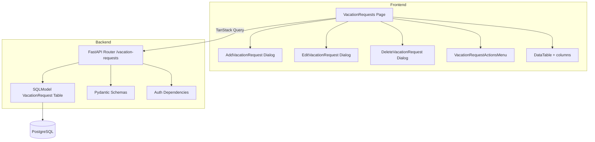
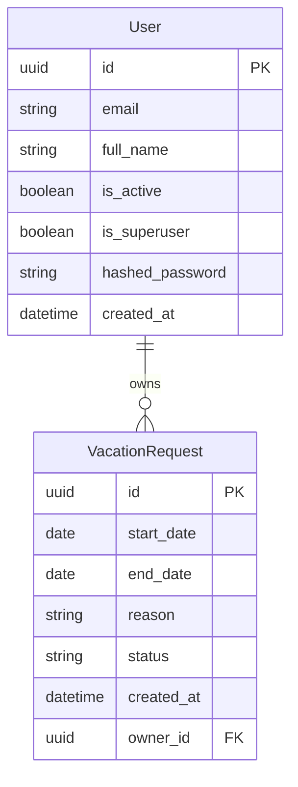

# Design Document: Vacation Requests

## Overview

This feature adds vacation request management to the application, allowing users to create, view, edit, and delete vacation requests. All authenticated users can view all vacation requests across the organization (for team visibility), but only the owner (or a superuser) can modify or delete a request.

The implementation follows the exact same architectural patterns as the existing time-tracking feature: SQLModel table + Pydantic schemas in `models.py`, a FastAPI router in `api/routes/`, an Alembic migration, pytest integration tests, and a React page with TanStack Router/Query and dialog-based CRUD forms.

Approval workflows are explicitly out of scope — the `status` field defaults to `"pending"` and additional statuses will be handled by a future feature.

## Architecture



The feature is a vertical slice through the stack:

1. **Database layer**: `VacationRequest` SQLModel table with FK to `User`
2. **API layer**: FastAPI router with CRUD endpoints + ownership checks
3. **Frontend layer**: Route page, data table, and CRUD dialogs
4. **Navigation**: Sidebar link added to `baseItems`

## Components and Interfaces

### Backend

#### Model: `VacationRequest` (SQLModel table)

| Field | Type | Constraints |
|-------|------|-------------|
| `id` | `UUID` | PK, auto-generated |
| `start_date` | `date` | Required |
| `end_date` | `date` | Required, >= start_date |
| `reason` | `str` | 1–500 chars |
| `status` | `str` | max 20 chars, default `"pending"`, constrained to `"pending"` / `"approved"` / `"rejected"` |
| `created_at` | `datetime` | UTC, auto-set |
| `owner_id` | `UUID` | FK → `user.id`, CASCADE delete |

#### Schemas

| Schema | Purpose | Fields |
|--------|---------|--------|
| `VacationRequestBase` | Shared fields | `start_date`, `end_date`, `reason` |
| `VacationRequestCreate` | POST body | Inherits Base |
| `VacationRequestUpdate` | PUT body | All optional: `start_date`, `end_date`, `reason`, `status` |
| `VacationRequestPublic` | Response | All stored fields + `id`, `owner_id`, `created_at` |
| `VacationRequestsPublic` | List response | `data: list[VacationRequestPublic]`, `count: int` |

#### Validation

- `VacationRequestBase` uses a Pydantic `model_validator(mode="after")` to enforce `end_date >= start_date`.
- `VacationRequestUpdate` uses a `model_validator` that checks the constraint only when both date fields are provided in the update payload. The route handler performs a merged check when only one date is updated.
- `reason` uses `Field(min_length=1, max_length=500)`.
- `status` uses `Field(max_length=20)` with a Literal type or validator constraining values.

#### Router: `api/routes/vacation_requests.py`

| Endpoint | Method | Auth | Visibility |
|----------|--------|------|------------|
| `/vacation-requests/` | GET | Required | All requests (all users) |
| `/vacation-requests/` | POST | Required | Creates for current user |
| `/vacation-requests/{id}` | GET | Required | Any request (all users) |
| `/vacation-requests/{id}` | PUT | Required | Owner or superuser |
| `/vacation-requests/{id}` | DELETE | Required | Owner or superuser |

**Design decisions:**
- List endpoint returns ALL vacation requests regardless of ownership (team visibility requirement).
- Single GET also allows any authenticated user to read any request.
- PUT/DELETE enforce owner-or-superuser access control, matching the TimeEntry pattern.
- On PUT, the handler merges the update payload with existing values and validates the resulting date range before persisting.

#### Migration

New Alembic migration creating the `vacationrequest` table with:
- UUID PK
- `start_date` DATE NOT NULL
- `end_date` DATE NOT NULL
- `reason` VARCHAR(500) NOT NULL
- `status` VARCHAR(20) NOT NULL DEFAULT 'pending'
- `created_at` TIMESTAMP WITH TIME ZONE
- `owner_id` UUID NOT NULL FK → `user.id` ON DELETE CASCADE
- CHECK constraint: `end_date >= start_date`

### Frontend

#### Route: `/_layout/vacation-requests`

File: `frontend/src/routes/_layout/vacation-requests.tsx`

Pattern mirrors `time-entries.tsx`:
- `useSuspenseQuery` fetching `VacationRequestsService.readVacationRequests`
- Empty state with "No vacation requests" message
- `DataTable` with columns definition
- `Suspense` wrapper with loading fallback (spinner)

#### Components

| Component | File | Purpose |
|-----------|------|---------|
| `AddVacationRequest` | `components/VacationRequests/AddVacationRequest.tsx` | Dialog with form (start_date, end_date, reason) |
| `EditVacationRequest` | `components/VacationRequests/EditVacationRequest.tsx` | Dialog pre-populated with existing values |
| `DeleteVacationRequest` | `components/VacationRequests/DeleteVacationRequest.tsx` | Confirmation dialog |
| `VacationRequestActionsMenu` | `components/VacationRequests/VacationRequestActionsMenu.tsx` | Dropdown with edit/delete |
| `columns` | `components/VacationRequests/columns.tsx` | Table column definitions |
| `PendingVacationRequests` | `components/VacationRequests/PendingVacationRequests.tsx` | Loading skeleton |

#### Column definitions

| Column | Source | Display |
|--------|--------|---------|
| Requester | `owner_id` (resolve to user name if available, else show ID) | Font medium |
| Start Date | `start_date` | Localized date |
| End Date | `end_date` | Localized date |
| Reason | `reason` | Truncated, max-w-xs |
| Status | `status` | Badge/chip |
| Created | `created_at` | Localized date |
| Actions | conditional | Only shown if `owner_id === currentUser.id` |

#### Client-side validation (Zod schema)

```typescript
const formSchema = z.object({
  start_date: z.string().min(1, "Start date is required"),
  end_date: z.string().min(1, "End date is required"),
  reason: z.string().min(1, "Reason is required").max(500, "Reason must be 500 characters or less"),
}).refine(
  (data) => data.end_date >= data.start_date,
  { message: "End date must be on or after start date", path: ["end_date"] }
)
```

#### Sidebar

Add to `baseItems` in `AppSidebar.tsx`:
```typescript
{ icon: Palmtree, title: "Vacation Requests", path: "/vacation-requests" }
```

Uses `Palmtree` icon from lucide-react (or `CalendarDays` as alternative).

## Data Models



**Relationships:**
- `User` 1:N `VacationRequest` via `owner_id` FK
- CASCADE delete: deleting a User removes all their VacationRequests
- No relationship to Project or TimeEntry (independent feature)

## Correctness Properties

*A property is a characteristic or behavior that should hold true across all valid executions of a system — essentially, a formal statement about what the system should do. Properties serve as the bridge between human-readable specifications and machine-verifiable correctness guarantees.*

### Property 1: Creation round-trip preserves data

*For any* valid combination of `start_date`, `end_date` (where end >= start), and `reason` (1–500 chars), creating a VacationRequest via POST and then reading it back via GET SHALL return the same `start_date`, `end_date`, and `reason`, with `status` equal to `"pending"` and `owner_id` equal to the creating user's ID.

**Validates: Requirements 1.1, 2.1**

### Property 2: Date range validation rejects invalid ranges

*For any* pair of dates where `end_date` is strictly earlier than `start_date`, submitting a VacationRequest (create or update) SHALL be rejected with HTTP 422, and no record SHALL be created or modified.

**Validates: Requirements 1.2, 1.3, 2.2, 5.4**

### Property 3: Reason length validation

*For any* string with length 0 or length > 500, submitting a VacationRequest with that string as `reason` SHALL be rejected with HTTP 422.

**Validates: Requirements 2.3**

### Property 4: Cascade delete removes all owned requests

*For any* User who owns N VacationRequests (N >= 0), deleting that User SHALL result in all N VacationRequests being removed from the database.

**Validates: Requirements 1.4**

### Property 5: Listing returns all requests with correct pagination

*For any* set of VacationRequests in the system and any valid `skip`/`limit` parameters, the list endpoint SHALL return exactly `min(limit, total - skip)` records (when skip < total), the `count` field SHALL equal the total number of VacationRequests, and records SHALL be ordered by `created_at` descending.

**Validates: Requirements 3.1, 3.2**

### Property 6: Ownership authorization

*For any* VacationRequest owned by User A, when User B (who is not a superuser and is not User A) attempts to PUT or DELETE that request, the API SHALL return HTTP 403 and the request SHALL remain unchanged.

**Validates: Requirements 5.2, 6.2**

### Property 7: Partial update correctness

*For any* existing VacationRequest and any valid partial update payload (subset of fields), applying the update SHALL change only the specified fields while preserving all unspecified fields at their original values, provided the resulting state passes validation.

**Validates: Requirements 5.1**

### Property 8: Empty update idempotence

*For any* existing VacationRequest, sending a PUT with an empty update payload (no fields set) SHALL return the VacationRequest unchanged.

**Validates: Requirements 5.5**

### Property 9: Client-side date validation prevents submission

*For any* form state where `end_date` < `start_date`, the UI form SHALL display an inline validation error on the end_date field and SHALL NOT submit the request to the API.

**Validates: Requirements 8.13**

## Error Handling

### Backend Errors

| Scenario | HTTP Status | Response |
|----------|-------------|----------|
| Invalid date range (end < start) | 422 | Validation error with message |
| Reason too short/long | 422 | Validation error with field details |
| Missing required field | 422 | Validation error listing missing field |
| Limit > 100 on list | 422 | Validation error |
| Not authenticated | 401 | Unauthorized |
| Not owner and not superuser (PUT/DELETE) | 403 | "Not enough permissions" |
| VacationRequest not found | 404 | "Vacation request not found" |

### Frontend Error Handling

- **API errors**: Caught by `onError` in mutation, displayed via `showErrorToast` with server message
- **Validation errors**: Zod schema validation prevents submission, inline `FormMessage` shown
- **Network errors**: Handled by TanStack Query's error state, displayed via toast
- **Loading states**: Suspense boundary shows spinner skeleton

### Error Flow

1. Client-side Zod validation catches invalid input before API call
2. If client validation passes, API call is made
3. Server-side Pydantic validation catches any remaining issues (422)
4. Business logic errors (403, 404) returned with descriptive messages
5. Frontend displays server error message in toast, keeps dialog open for 4xx errors

## Testing Strategy

### Unit Tests (pytest)

Following the pattern in `tests/api/routes/test_time_entries.py`:

- **Create**: Valid creation, invalid date range (422), invalid reason length (422), missing fields (422)
- **List**: All users see all requests, pagination with skip/limit, limit > 100 rejected
- **Read**: Any user can read any request, non-existent ID returns 404
- **Update**: Owner can update, superuser can update any, non-owner gets 403, non-existent ID gets 404, invalid date range after merge gets 422, empty update returns unchanged
- **Delete**: Owner can delete, superuser can delete any, non-owner gets 403, non-existent ID gets 404
- **Cascade**: User deletion removes all owned requests

### Property-Based Tests (Hypothesis)

Library: **Hypothesis** (Python PBT library, standard for pytest projects)

Configuration: Minimum 100 examples per property test.

Each property test is tagged with:
```python
# Feature: vacation-requests, Property {N}: {property_text}
```

Properties to implement:
1. Creation round-trip
2. Date range validation
3. Reason length validation
4. Cascade delete
5. Listing pagination invariants
6. Ownership authorization
7. Partial update correctness
8. Empty update idempotence

### Frontend Tests

- Component tests using Vitest + React Testing Library
- Mock API responses via MSW or manual mocks
- Test form validation (date range, reason length)
- Test conditional rendering of actions menu based on ownership
- Test loading/empty states

### Test Utilities

Create `tests/utils/vacation_request.py` following the pattern of `tests/utils/time_entry.py`:
- `create_random_vacation_request(db, owner_id)` helper function
- Generates valid random date ranges and reasons for test data
