# System Design — Time Tracking Application

## 1. High-Level System Architecture

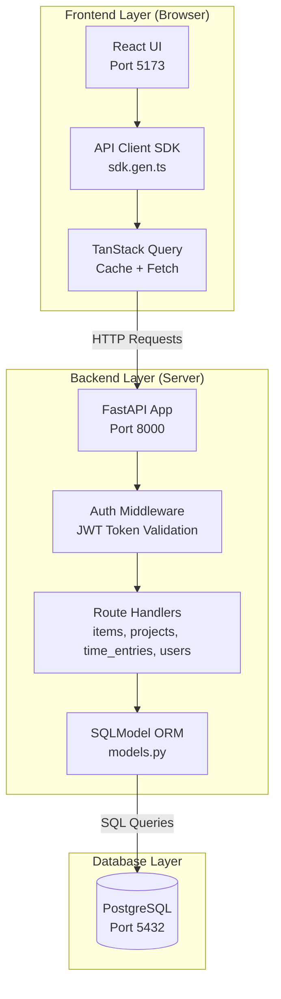

---

## 2. Logical Components by Layer

### Frontend (React/TypeScript)

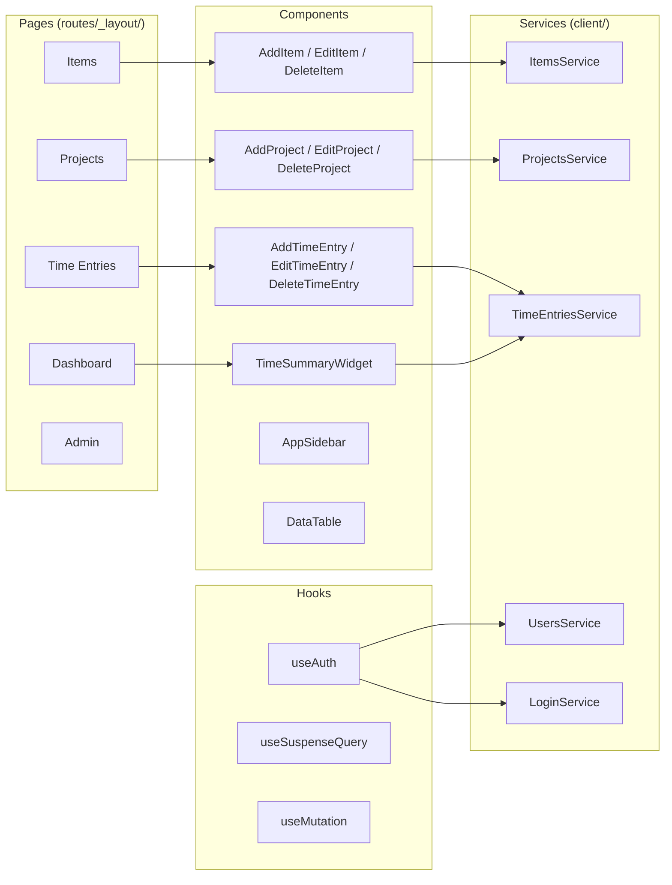

### Backend (Python/FastAPI)

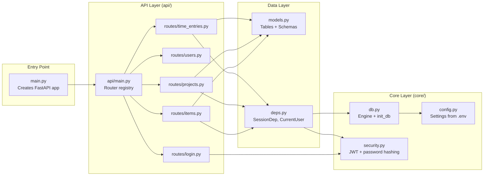

### Database (PostgreSQL)

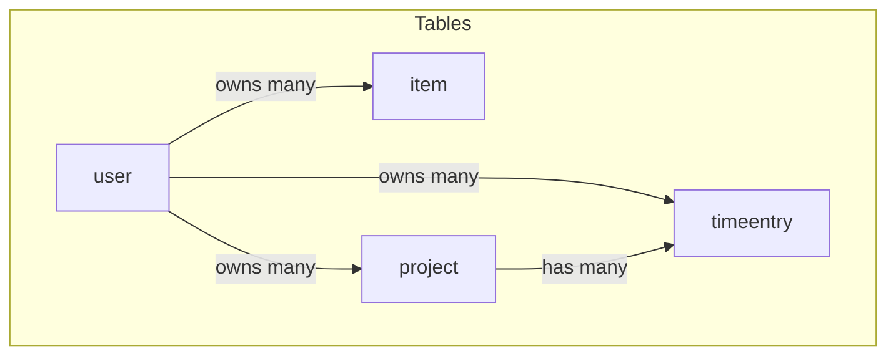

---

## 3. Data Model (Entity Relationship Diagram)

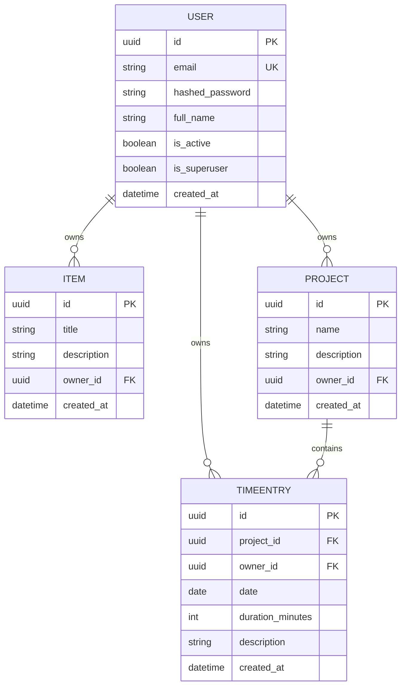

### Relationship Rules

| Relationship | Type | Cascade |
|---|---|---|
| User → Items | One-to-Many | Delete user → delete all their items |
| User → Projects | One-to-Many | Delete user → delete all their projects |
| User → TimeEntries | One-to-Many | Delete user → delete all their time entries |
| Project → TimeEntries | One-to-Many | Delete project → delete all its time entries |

---

## 4. Major Flows

### Flow 1: User Login

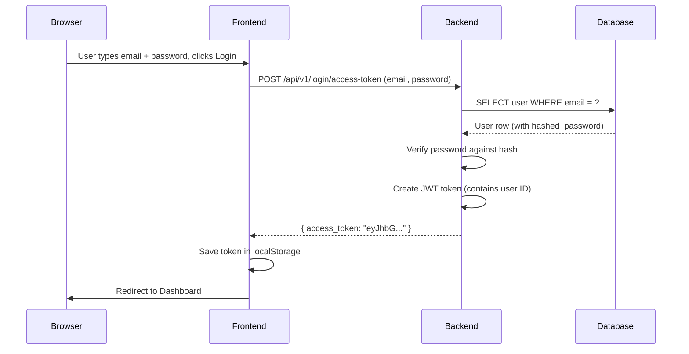

### Flow 2: Load Projects Page

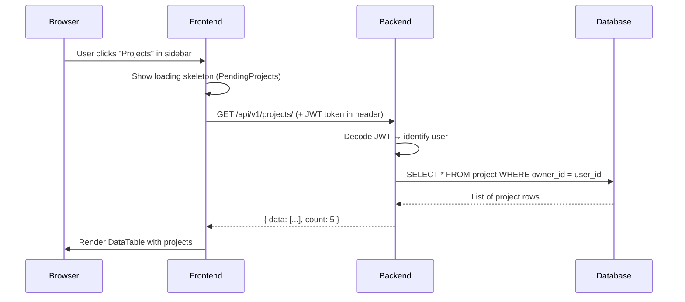

### Flow 3: Create a Time Entry

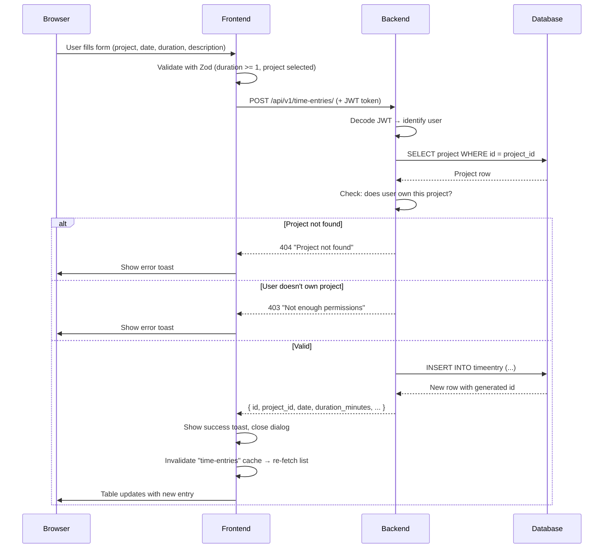

### Flow 4: Dashboard Summary Widget

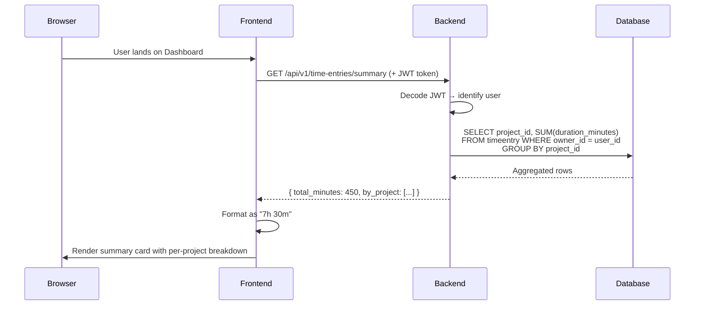

### Flow 5: Delete Project (Cascade)

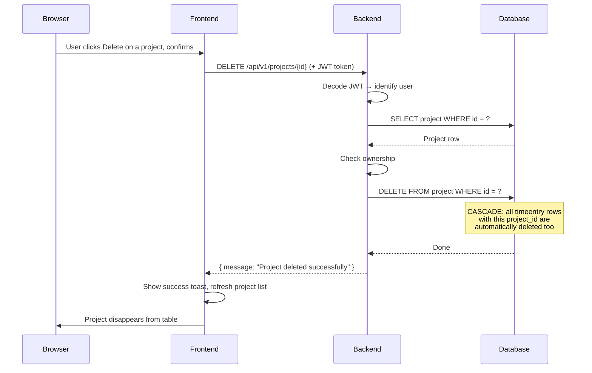

---

## 5. API Endpoint Map

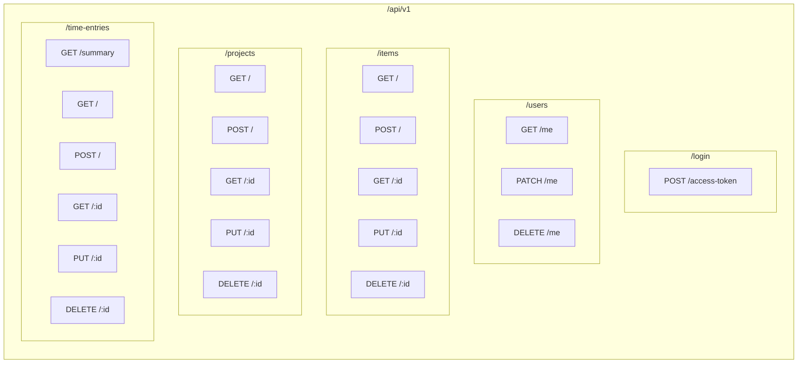
